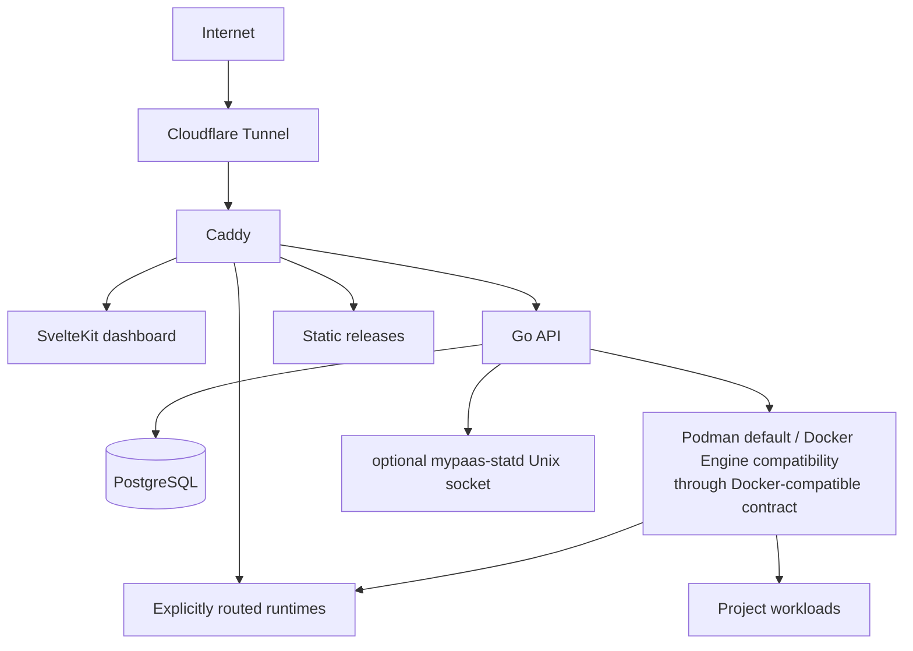

# MyPaas — Self-Hosted Deployment Platform

> Deploy Git repositories and public OCI images to your own Linux VM with managed builds, routing, environment configuration, logs, metrics, database tooling, backups, and recovery controls.

**Release status:** Beta  
**Release line:** `v0.5.0-beta.1`  
**Qualified runtime candidate:** `ddc26c9a0f877fc5dd4133d6559c5f36123d6a31`

MyPaas is a **single-host self-hosted PaaS** for an owner developer or a small trusted team. It aims to provide a deployment workflow closer to Vercel or Railway while keeping the VM, container engine, persistent data, and routing path under your control.

The control plane is built with Go, SvelteKit, PostgreSQL, Caddy, and Cloudflare Tunnel. On fresh supported Linux hosts, MyPaas is **Podman-first**: the installer defaults to rootful Podman and exposes its socket through the Docker-compatible command/socket contract used by the control plane. Docker Engine remains supported as an explicit compatibility mode for existing installations and operators that intentionally select it with `USE_PODMAN=false`. Static projects are served directly by Caddy without a persistent application container.

> Beta means the mandatory release gates have passed for the qualified candidate; it does **not** mean MyPaas provides multi-node HA, hard multi-tenant isolation, or hyperscaler-grade operational guarantees.

## What is implemented

### Sources and deployment modes

| Source | Mode | Behavior |
| --- | --- | --- |
| Git | Dockerfile | Build and run a repository Dockerfile |
| Git | Docker Compose | Manage a multi-service Compose project |
| Git | Static | Publish static output directly through Caddy |
| Public registry | OCI image | Pull and run a public image from Docker Hub, GHCR, or compatible registries |

Git deployments support repository inspection, branch selection, base directories, runtime detection, environment-template discovery, Compose preflight checks, and GitHub webhook deployments.

### Runtime operations

- deployment history and build logs;
- start, stop, restart, redeploy, and rollback for supported container-backed deployments;
- automatic Caddy route reconciliation;
- encrypted environment variables;
- per-project CPU and memory configuration;
- SSE-backed project status, logs, metrics, and deployment events;
- Compose service logs and metrics;
- public image digest/reference tracking where available.

### Data and platform operations

- optional shared PostgreSQL provisioning;
- DB Studio Lite for PostgreSQL, MySQL, and MariaDB;
- read-only DB Studio by default with explicit expiring write sessions;
- scheduled PostgreSQL backups and retention;
- scoped cleanup of unused MyPaas-managed images and build cache;
- GitHub OAuth, whitelist-based access, owner/collaborator roles, and audit logs;
- Prometheus-compatible API metrics plus `/health` and `/ready` endpoints;
- optional `mypaas-statd` host/runtime telemetry with Docker-compatible metrics fallback.

### Operator tooling

- browser setup wizard;
- one-line bootstrap installer for fresh Ubuntu/Debian hosts;
- `mypaas` CLI for common operator actions;
- opt-in self-update flow using SHA-pinned GHCR images and post-update verification;
- VM migration export/import tooling;
- local MCP bridge for agent-assisted operations.

## Beta qualification

The beta-readiness program exercised eight mandatory gates:

1. update / release safety;
2. backup / fresh-VM restore;
3. 10 / 25 / 50-project performance;
4. concurrent-deploy resilience;
5. Docker / build-cache retention;
6. Create Project runtime contract;
7. DB Studio Compose reliability;
8. documentation / limitations reconciliation.

All eight gates are recorded as `PASS` in [`docs/engineering/beta-readiness-gates.md`](docs/engineering/beta-readiness-gates.md).

The final runtime-affecting candidate was:

```text
ddc26c9a0f877fc5dd4133d6559c5f36123d6a31
```

Later release-documentation commits contain no runtime code changes and do not replace that qualification identity.

### Capacity evidence

A controlled 10/25/50-project qualification completed the 50-project tier successfully on the tested 4-vCPU / ~8-GiB VM. Treat that as **evidence for that VM shape and workload mix**, not as a universal capacity guarantee. Real limits depend on application memory/CPU demand, image/build behavior, storage, and host configuration.

## Known beta boundaries

MyPaas currently targets a deliberately narrow operating model:

- **single Linux host**; no Kubernetes, cluster scheduler, or multi-node HA;
- **Podman-first fresh-host runtime**; rootful Podman is the installer default, while Docker Engine is an explicit supported compatibility mode;
- **owner / small trusted-team model**; it is not a hostile multi-tenant isolation boundary;
- **public OCI registries only**; private-registry credential storage is not implemented;
- **no supported in-place Docker → Podman state migration**; use the supported migration/export flow to a fresh host rather than switching a stateful installation in place;
- performance and capacity are installation-specific;
- the dashboard does not yet surface a disk-pressure warning UI, although manual and scheduled retention paths are implemented;
- production Create Project qualification is intentionally non-destructive.

See [`docs/SECURITY_BOUNDARIES.md`](docs/SECURITY_BOUNDARIES.md) for the security model and [`docs/engineering/beta-readiness-gates.md`](docs/engineering/beta-readiness-gates.md) for evidence-backed release gates.

## Install the beta release

The bootstrap installer accepts an explicit Git ref through `MYPAAS_REF`. For a reproducible beta installation, pin both the downloaded script and checkout to the release tag:

```bash
curl -fsSL https://raw.githubusercontent.com/nabilrn/MyPaas/v0.5.0-beta.1/scripts/bootstrap.sh | \
  env MYPAAS_REF=v0.5.0-beta.1 bash
```

On a fresh supported Ubuntu/Debian host, that command **defaults to rootful Podman**. MyPaas still uses the `docker` / `docker compose` command surface and a Docker-compatible socket internally, so Podman does not require a second orchestration backend.

To intentionally use Docker Engine instead:

```bash
curl -fsSL https://raw.githubusercontent.com/nabilrn/MyPaas/v0.5.0-beta.1/scripts/bootstrap.sh | \
  env MYPAAS_REF=v0.5.0-beta.1 USE_PODMAN=false bash
```

The setup wizard binds locally and can be exposed temporarily through the supported Cloudflare Quick Tunnel flow or SSH forwarding.

> `AUTO_UPDATE_ENABLED` defaults to `false`. Enabling auto-update toward `main` opts into commits newer than the beta release, so keep it disabled for a strictly pinned beta installation unless that is intentional.

## Container images

After successful CI on `main`, GitHub Actions publishes API and dashboard images to GHCR with immutable commit-SHA tags and `latest`.

Use immutable SHA tags for controlled production updates and rollback-sensitive operations. The release tag identifies the source release; the runtime image identity remains the tested/published commit SHA.

## Architecture



MyPaas intentionally remains a single-host platform. Fresh supported Linux installs use rootful Podman by default, while the backend deliberately keeps a Docker-compatible CLI/socket contract so Docker Engine can remain a supported compatibility mode without a second orchestration implementation.

## Documentation

Start with:

- [`docs/README.md`](docs/README.md) — documentation index and source-of-truth rules;
- [`docs/ARCHITECTURE.md`](docs/ARCHITECTURE.md) — architecture overview;
- [`docs/SECURITY_BOUNDARIES.md`](docs/SECURITY_BOUNDARIES.md) — trust and isolation boundaries;
- [`docs/STATD.md`](docs/STATD.md) — `mypaas-statd` integration and benchmark evidence;
- [`docs/engineering/beta-readiness-gates.md`](docs/engineering/beta-readiness-gates.md) — beta gate matrix and qualification provenance;
- [`docs/releases/v0.5.0-beta.1.md`](docs/releases/v0.5.0-beta.1.md) — beta release notes;
- [`PRODUCT.md`](PRODUCT.md) — product scope and non-goals.

`docs/PRD.md` is a historical requirements document and is not authoritative for current runtime behavior.

## Development

Typical local workflow:

```bash
make dev
make test
make build
```

See [`CONTRIBUTING.md`](CONTRIBUTING.md) and [`AGENTS.md`](AGENTS.md) for repository conventions.

## License

See [`LICENSE`](LICENSE).
