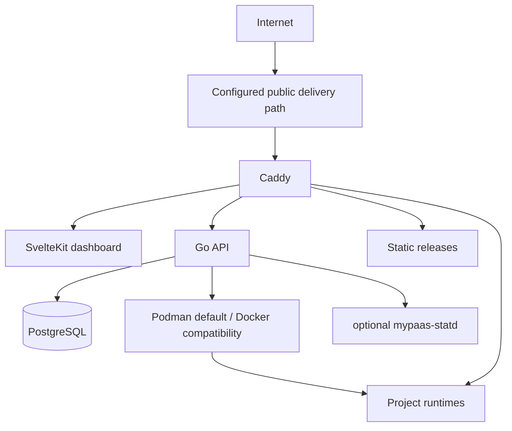

# MyPaaS

MyPaaS is a self-hosted deployment platform for running Git repositories and public OCI images on a Linux server.

**Status:** Beta

It is intentionally a **single-host** platform for an owner developer or a small trusted team. MyPaaS manages deployment and operations; it does not make an application scale beyond the CPU, memory, storage, network, database, or application design available to it.

## What it does

- deploy Git repositories with Dockerfile, Docker Compose, or static output;
- deploy public OCI images from compatible registries;
- inspect repositories and support base-directory / monorepo deployments;
- manage environment variables, deployment history, logs, metrics, restart, redeploy, and rollback;
- route projects through Caddy;
- provide optional PostgreSQL provisioning and DB Studio Lite for PostgreSQL, MySQL, and MariaDB;
- provide backups, restore/migration tooling, image/cache retention, audit logs, CLI, REST API, webhooks, and an optional local MCP bridge;
- use rootful Podman by default on fresh supported hosts, with Docker Engine as a compatibility mode.

Static projects are served directly by Caddy. Container-backed projects run through the configured container engine.

## Deployment modes

| Source | Mode |
| --- | --- |
| Git repository | Dockerfile |
| Git repository | Docker Compose |
| Git repository | Static |
| Public registry | OCI image |

Dockerfile and Compose are the explicit escape hatches for applications that do not fit automatic repository inspection.

## Operating boundary

MyPaaS currently assumes:

- one Linux host;
- an owner or small trusted team;
- public OCI registries;
- no Kubernetes or multi-node scheduler;
- no hostile multi-tenant isolation guarantee;
- no universal application-capacity guarantee.

Application capacity is workload-specific. A small static site, a Go service, a large SSR application, a database-heavy service, and a memory-intensive build can have completely different resource requirements on the same host. Project count, concurrent users, RPS, or a specific VM size are therefore **not product capabilities claimed by MyPaaS**.

On a single-host installation, builds, the MyPaaS control plane, databases, and running applications may compete for the same host resources. Operators should size the host for their workloads and lower deployment concurrency when resource pressure requires it.

See [`PRODUCT.md`](PRODUCT.md) and [`docs/SECURITY_BOUNDARIES.md`](docs/SECURITY_BOUNDARIES.md) for the current product and security boundaries.

## Verification

Repository CI and controlled runtime regression tests cover platform behavior such as:

- update and rollback safety;
- backup and restore;
- concurrent deployment state and failure isolation;
- image/cache retention;
- Create Project behavior;
- DB Studio connectivity and access controls.

These checks verify MyPaaS behavior. They are **not a benchmark or certification of how much application traffic a particular server can handle**.

See [`docs/engineering/beta-readiness-gates.md`](docs/engineering/beta-readiness-gates.md) for the retained runtime verification record.

## Architecture



## Documentation

- [`docs/README.md`](docs/README.md) — documentation index
- [`docs/ARCHITECTURE.md`](docs/ARCHITECTURE.md) — architecture
- [`docs/SECURITY_BOUNDARIES.md`](docs/SECURITY_BOUNDARIES.md) — trust and isolation boundaries
- [`docs/STATD.md`](docs/STATD.md) — optional native telemetry integration
- [`PRODUCT.md`](PRODUCT.md) — product scope and non-goals

## Development

```bash
make dev
make test
make build
```

See [`CONTRIBUTING.md`](CONTRIBUTING.md) and [`AGENTS.md`](AGENTS.md) for repository conventions.

## License

See [`LICENSE`](LICENSE).
