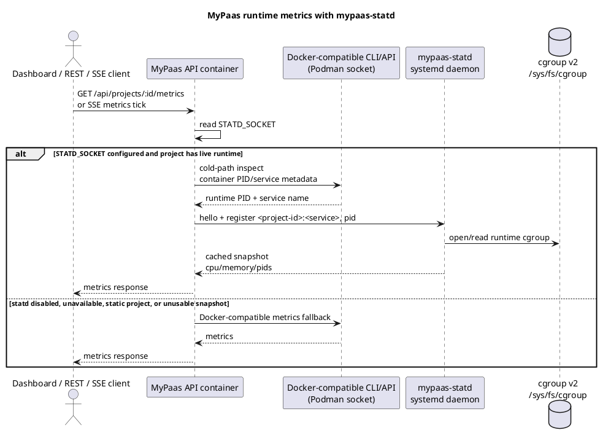

# mypaas-statd Integration

`mypaas-statd` is the preferred runtime metrics path for live Dockerfile and Compose projects when the host has the daemon installed and `STATD_SOCKET` configured.

It is intentionally a host-native systemd daemon, not a MyPaas control-plane container and not a GHCR sidecar image. The daemon reads host cgroup v2 counters and serves cached snapshots over a local Unix socket.

## Install Source

`scripts/install-vm.sh` installs statd by default from:

```text
https://github.com/nabilrn/mypaas-statd.git
```

The installer checks out `STATD_REF` (`main` by default), runs the statd repository's `make install`, enables `mypaas-statd.service`, and writes:

```text
STATD_SOCKET=/run/mypaas/statd.sock
```

Operator knobs:

```text
INSTALL_STATD=true
STATD_REPO_URL=https://github.com/nabilrn/mypaas-statd.git
STATD_REF=main
STATD_DIR=/opt/mypaas-statd
```

Set `INSTALL_STATD=false` to skip the daemon and use the Docker-compatible metrics fallback only.

## Runtime Flow



The steady-state statd path avoids spawning Docker/Podman process-discovery commands on every metrics refresh. The fallback path remains available so rollout is reversible.

Runtime ID format:

```text
<project-uuid>:<service-name>
```

Example:

```text
784283cd-0b53-42eb-bd9a-e1c729e86f41:app
```

## Benchmark Evidence

The accepted Phase 4 real-host benchmark evidence is preserved in the `nabilrn/mypaas-statd` repository:

```text
benchmarks/results/phase4-debian13-podman-2026-08-10/
```

Evidence source:

```text
https://github.com/nabilrn/mypaas-statd/tree/main/benchmarks/results/phase4-debian13-podman-2026-08-10
```

Tested statd commit:

```text
cf8843545ea19ecf9a54049e21b2fe609e49d58d
```

Environment:

- Debian GNU/Linux 13
- kernel `6.12.88+deb13-amd64`
- rootful Podman 5.4.2
- Docker-compatible path `/var/run/docker.sock -> /run/podman/podman.sock`
- no Docker Engine/dockerd

Method:

- one rootful Podman Alpine workload
- warmup: 50 samples
- recorded iterations: 500 per trial
- trials: 3
- baseline: `docker stats --no-stream` through the Podman-backed Docker-compatible command/socket path
- statd path: protocol v1 over `/run/mypaas/statd.sock`, using connect + hello + snapshot per sample

The raw JSON files remain the source of truth. The table below repeats the recorded values without rounding.

| Run | Path | p50_ms | p95_ms | p99_ms | mean_ms | max_ms | wall_seconds | process_spawns |
| --- | --- | ---: | ---: | ---: | ---: | ---: | ---: | ---: |
| 1 | Docker-compatible CLI | 41.039357499999994 | 51.9851865 | 57.27985834999998 | 42.131678146 | 68.288171 | 21.067599074 | 500 |
| 1 | mypaas-statd | 0.7803485 | 0.8812820499999998 | 1.0528069899999999 | 0.793765936 | 1.255629 | 0.397203313 | 0 |
| 2 | Docker-compatible CLI | 41.5558045 | 53.618609249999956 | 64.31991137 | 43.004707342 | 72.804908 | 21.504005963 | 500 |
| 2 | mypaas-statd | 0.7968685 | 1.0064879999999998 | 1.1074274999999998 | 0.826836158 | 4.199228 | 0.413757872 | 0 |
| 3 | Docker-compatible CLI | 43.2664495 | 55.993713 | 64.04532325 | 43.954954898000004 | 68.152107 | 21.978995991 | 500 |
| 3 | mypaas-statd | 0.820184 | 1.08817145 | 1.2006058099999999 | 0.870551032 | 1.544936 | 0.43590697 | 0 |

Additional observations from the same evidence:

| Run | Docker CLI child CPU seconds | statd daemon CPU seconds | statd RSS before | statd RSS after | statd voluntary context switches | statd involuntary context switches |
| --- | ---: | ---: | ---: | ---: | ---: | ---: |
| 1 | 19.248283 | 0.03 | 1859584 | 1859584 | 1973 | 27 |
| 2 | 19.720067 | 0.03 | 1859584 | 1859584 | 1963 | 30 |
| 3 | 19.956553 | 0.03999999999999998 | 1859584 | 1859584 | 1982 | 12 |

Correctness checks in the evidence compared statd snapshots against raw cgroup v2 files for memory, PID, and CPU counter semantics. Runtime disappearance was also tested: statd returned `NOT_FOUND` after the container stopped and the daemon remained active.

Protocol v1 does not expose a sampler timestamp, so MyPaas documentation must not claim metric freshness or metric age from these benchmark files.

## Publish Model

Do not publish `mypaas-statd` as a required container image for MyPaas production. That would require privileged host PID/cgroup mounts and would make the validated host-native model more complex.

Preferred publish path:

1. GitHub Release artifacts from `nabilrn/mypaas-statd`, such as `mypaas-statd-linux-amd64.tar.gz`, checksum files, and the systemd unit.
2. A Debian package once packaging is stable.
3. Source install fallback through `scripts/install-vm.sh` while release artifacts are not available.

MyPaas API and dashboard remain GHCR images. `mypaas-statd` remains a host tool installed by the VM installer and consumed through `STATD_SOCKET`.
